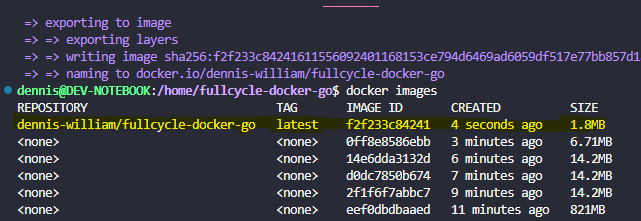
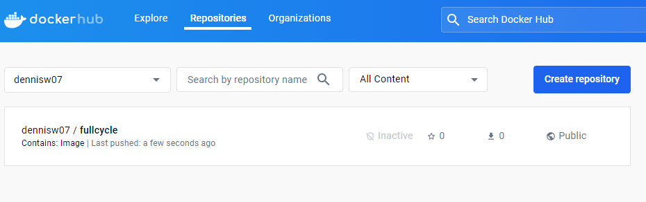

# fullcycle-docker-go

Desafio de projeto docker para criar uma imagem utilizando a linguagem GO

# COMANDOS

- Build da Imagem:
sudo docker build . --no-cache -t fullcycle-docker-go

- Executar container
sudo docker run -p 8080:8080 fullcycle-docker-go

- Criar Tag da imagem para publicação
docker tag fullcycle-docker-go dennisw07/fullcycle:1.0

- Publicar imagem no dockerhub
docker push dennisw07/fullcycle:1.0

# DESAFIO

- Criar imagem Go com menos de 2MB e que exibe a mensagem "FullCycle Rocks!!" ao executar a imagem

Foi necessário criar uma imagem scratch para conseguir diminuir o tamanho da imagem drasticamente, esse tipo de imagem não tem um sistema operacional base e um shell, assim a imagem é gerada apenas com o binário do aplicação executável.

- Publicar no DockerHub a imagem

Link: docker pull dennisw07/fullcycle:1.0

