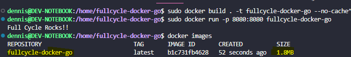

# fullcycle-docker-go

Desafio de projeto docker para criar uma imagem utilizando a linguagem GO

# COMANDOS

- Build da Imagem:
sudo docker build . --no-cache -t dennis-william/fullcycle-docker-go

- Executar container
sudo docker run -p 8080:8080 dennis-william/fullcycle-docker-go

# DESAFIO

- Criar imagem Go com menos de 2MB e que exibe a mensagem "FullCycle Rocks!!" ao executar a imagem

